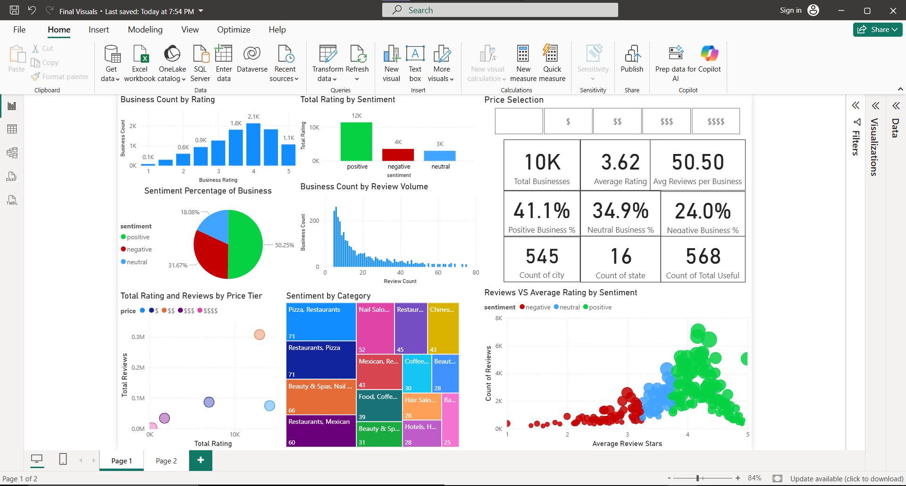
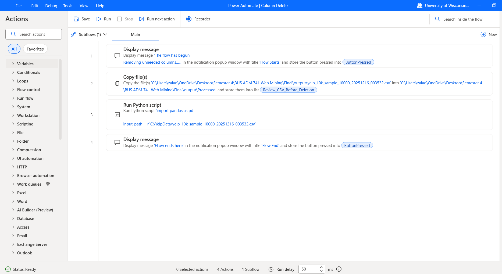
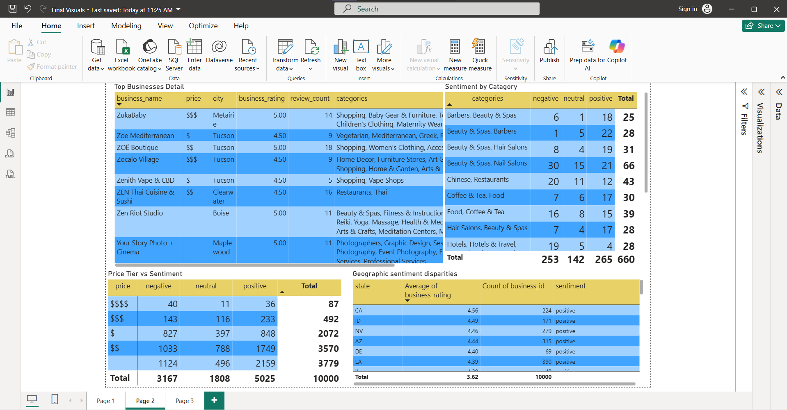

# Yelp Business Sentiment Analysis: Python ETL + Power Automate + Power BI

An end-to-end data pipeline that transforms the semi-structured **Yelp Open Dataset** (JSON Lines) into an interactive **Power BI dashboard** analyzing business sentiment by category, price tier, geography, and review volume.

**Tech stack:** Python · pandas · Power Automate Desktop · Power BI · DAX · ETL · Feature Engineering · Data Visualization



## Key Results

A sample of **10,000 businesses** across **545 cities in 16 U.S. states**:

| Metric                         |      Value |
| ------------------------------ | ---------: |
| Average business rating        | 3.62 stars |
| Positive (4.0 stars and above) |     50.25% |
| Neutral (3.5 stars)            |     18.08% |
| Negative (3.0 stars and below) |     31.67% |

* **Category:** Pizza restaurants and nail salons show the highest negative share (about 46%), while barbers and hair salons are near 25%.
* **Price tier:** Premium ($$$$) businesses have the highest negative share at 46%.
* **Review volume:** Businesses with few reviews tend to have higher average ratings, while heavily reviewed businesses trend toward lower averages.

| Price tier | Negative | Neutral | Positive | Total | % Negative |
| ---------- | -------: | ------: | -------: | ----: | ---------: |
| $$$$       |       40 |      11 |       36 |    87 |      46.0% |
| $$$        |      143 |     116 |      233 |   492 |      29.1% |
| $$         |    1,033 |     788 |    1,749 | 3,570 |      28.9% |
| $          |      827 |     397 |      848 | 2,072 |      39.9% |
| Not listed |    1,124 |     496 |    2,159 | 3,779 |      29.7% |

## Pipeline

```text
Yelp JSON Lines
(business + review files)
        |
        v
scripts/Importer_10k_reviews.py
        |
        v
Sample CSV
(10,000 businesses, 22 columns)
        |
        v
Power Automate Desktop
        |
        v
scripts/Column delete.py
        |
        v
Cleaned Excel file
(13 analysis columns)
        |
        v
Power BI data model + DAX measures
        |
        v
2-page interactive dashboard
```

## 1. Extraction and Feature Engineering

**Script:** `scripts/Importer_10k_reviews.py`

The importer:

* Streams the business JSON Lines file line by line, avoiding loading the entire file into memory.
* Skips blank and malformed JSON records.
* Collects the first 20,000 businesses in file order.
* Draws a reproducible random sample of 10,000 businesses using `random_state=42`.
* Engineers a rule-based sentiment tier from business star ratings:

  * Positive: 4.0+
  * Neutral: 3.5
  * Negative: 3.0 and below
* Creates price-tier and attribute-based features.
* Creates Wi-Fi, delivery, and takeout indicators.
* Streams the review file to calculate per-business review counts, average review stars, and total **useful** votes.
* Left-joins review statistics onto the business sample.

## 2. Automated Column Selection

**Script:** `scripts/Column delete.py`

The script selects the analysis-ready fields from the generated CSV and exports them to Excel.

The Power Automate Desktop workflow:

1. Displays a start message.
2. Copies the generated CSV to the processing location.
3. Runs the pandas transformation script.
4. Produces the cleaned Excel file.
5. Displays a completion message.



## 3. Visualization

**Platform:** Power BI Desktop

### Page 1 — Dashboard Overview

Includes:

* KPI cards
* Rating distribution
* Sentiment split
* Review-volume histogram
* Category treemap
* Price-tier slicer
* Review volume vs. rating scatter plot

### Page 2 — Business Details

Includes:

* Top-business detail tables
* Sentiment by category
* Price tier vs. sentiment
* Geographic breakdown



## How to Reproduce

Run the following steps from the repository root.

### 1. Download the dataset

Download the **Yelp Open Dataset** from the Yelp Dataset website and place the required JSON files in a `data/` directory:

```text
data/
├── yelp_academic_dataset_business.json
└── yelp_academic_dataset_review.json
```

The raw dataset is intentionally **not included in this repository**.

### 2. Generate the sample

Run:

```bash
python scripts/Importer_10k_reviews.py
```

This generates a CSV in the `output/` directory.

### 3. Clean the generated data

Update `input_path` in:

```text
scripts/Column delete.py
```

to match the generated CSV filename.

Then run:

```bash
python "scripts/Column delete.py"
```

The script creates:

```text
output/cleaned_yelp.xlsx
```

The transformation can also be triggered through the included Power Automate Desktop workflow.

### 4. Build the dashboard

Open the cleaned dataset in Power BI Desktop and create the data model, DAX measures, and visualizations described above.

## Requirements

* Python 3.9+
* pandas
* openpyxl
* Power BI Desktop
* Power Automate Desktop

Install the Python dependencies with:

```bash
pip install pandas openpyxl
```

## Limitations and Next Steps

* The sample is drawn from the first 20,000 businesses in file order rather than the entire business dataset. Reservoir sampling or another full-dataset sampling approach could provide a more representative sample.
* Sentiment is derived from star ratings rather than review text. NLP sentiment analysis using VADER, a transformer model, or another text-classification approach would provide a richer sentiment measure.
* The current analysis does not include a time dimension. Incorporating review dates would enable sentiment and rating trend analysis.
* The observed relationships are correlational and should not be interpreted as causal.

## Author

**Mohammed Zaid**
M.S. Information Science & Technology
University of Wisconsin–Milwaukee
